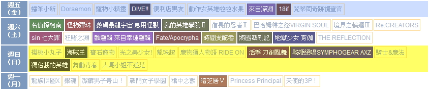
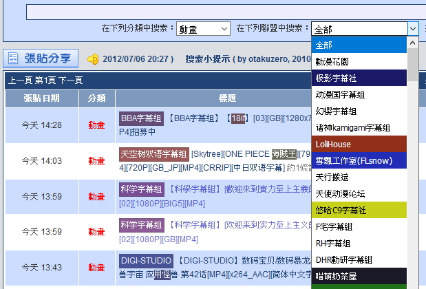

# gm-user-scripts

各種網站 UX 優化 與 搭配某些插件/行為時的簡化動作

## install

### 腳本管理器

- Chrome: [Tampermonkey](https://chrome.google.com/webstore/detail/tampermonkey/dhdgffkkebhmkfjojejmpbldmpobfkfo)
- Firefox: [Greasemonkey](https://addons.mozilla.org/firefox/addon/greasemonkey/)
- Firefox mobile: [usi (User|Unified Script Injector)](https://addons.mozilla.org/firefox/addon/userunified-script-injector/) 

### 腳本

#### ux-tweak-sc

安裝連結 [ux-tweak-sc.user.js](https://github.com/bluelovers/gm-user-scripts/raw/master/dist/ux-tweak-sc.user.js)

old version: https://gist.github.com/bluelovers/5186199
