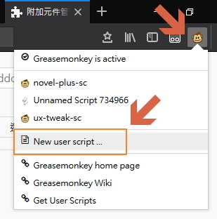

# 在 Firefox 57 greasemonkey 安裝腳本的方法

1. 嘗試安裝 [Beta](https://addons.mozilla.org/zh-TW/firefox/addon/greasemonkey/versions/beta) 版
2. 手動編輯將腳本內容新增進去 
3. 傻瓜般的一直重覆點到出現安裝畫面為止
4. 到這裡 [issues](https://github.com/greasemonkey/greasemonkey/issues) 詢問...
5. ...放棄 greasemonkey 直到問題修正為止
