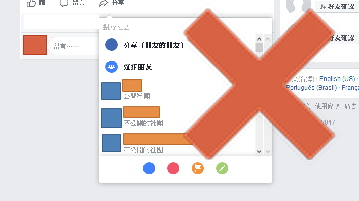
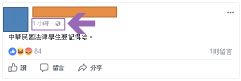

# fuck-u-fb-share

> 此腳本試圖解決智障 FB 新分享機制導致的困擾 並且恢復為舊版分享 (2017-11)

分享用網址 [http://lnk.pics/4D3CJ](http://lnk.pics/4D3CJ) (會得到比較友善一點的連結預覽)

## install

### 腳本管理器

請先安裝此瀏覽器附加元件

- Chrome: [Tampermonkey](https://chrome.google.com/webstore/detail/tampermonkey/dhdgffkkebhmkfjojejmpbldmpobfkfo)
- Firefox: [Greasemonkey](https://addons.mozilla.org/firefox/addon/greasemonkey/)
- Firefox mobile: [usi (User|Unified Script Injector)](https://addons.mozilla.org/firefox/addon/userunified-script-injector/)

### 腳本

#### fuck-u-fb-share

然後點擊此處安裝腳本 [fuck-u-fb-share.user.js](https://github.com/bluelovers/gm-user-scripts/raw/master/dist/fuck-u-fb-share.user.js)

## issues

可以在此回報 BUG [issues](https://github.com/bluelovers/gm-user-scripts/issues)

> 回報時請盡量附上貼文網址 以及 截圖

### FAQ

1. 很抱歉，這則貼文的隱私設定表示你無法分享它。

> 這問題並非此腳本所造成而是目前 FB 本身自己的 BUG
> 點擊貼文時間可以取得該篇貼文的網址
> 透過另外開啟貼文之後 再進行分享

