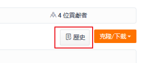

# gitee-plus

    於 Gitee 碼雲 增加一點小功能

## install

1. 請參閱 [安裝需求](userscript.md)

### 腳本

#### novel-plus-sc

然後點擊此處安裝腳本 [gitee-plus.user.js](https://github.com/bluelovers/gm-user-scripts/raw/master/dist/gitee-plus.user.js)

## screenshots

### 可依照資料夾顯示歷史紀錄

