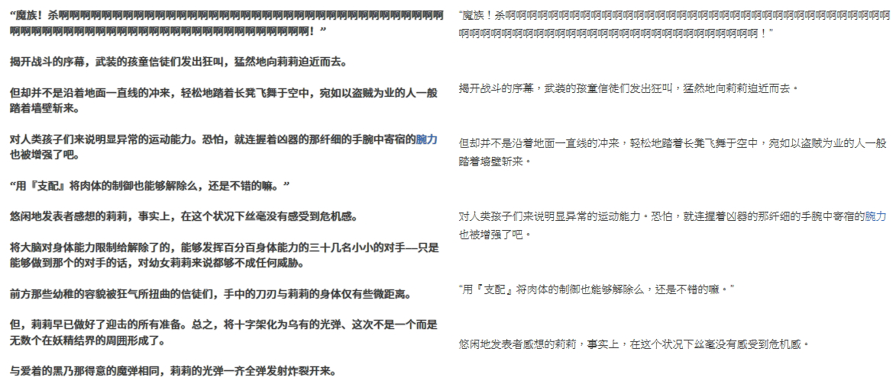
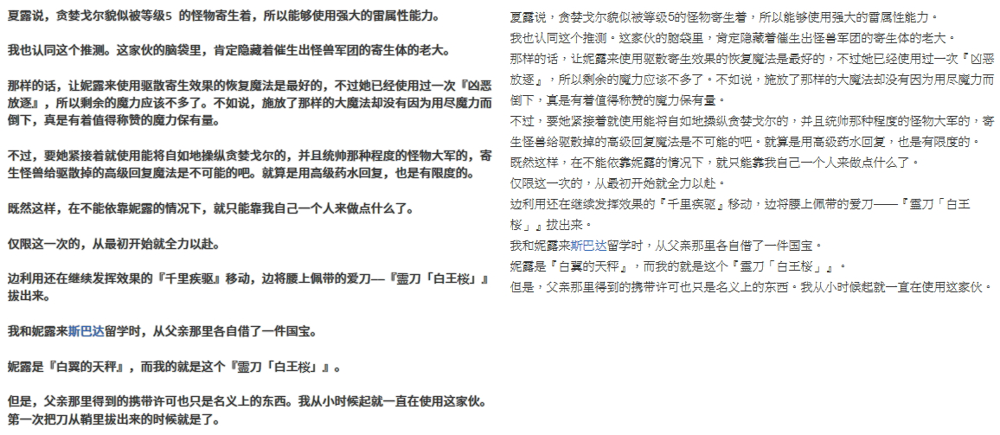
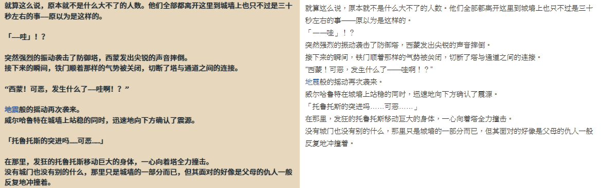
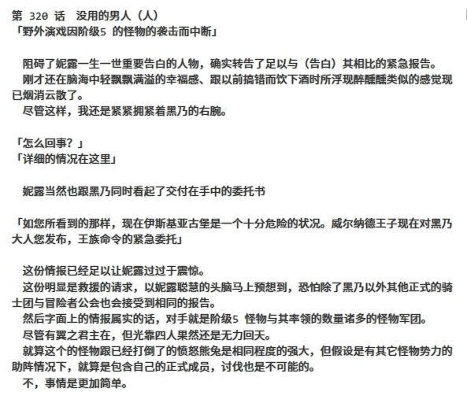

# novel-plus-sc

> 部分小說網站重新排版、修正文字，改變閱讀樣式
> 並且適用於搬運貼吧內小說時預先整理內容

## install

1. 請參閱 [安裝需求](userscript.md)

### 腳本

#### novel-plus-sc

然後點擊此處安裝腳本 [novel-plus-sc.user.js](https://github.com/bluelovers/gm-user-scripts/raw/master/dist/novel-plus-sc.user.js)

### 範例

1. 修正多餘分行 [demo](https://tieba.baidu.com/p/5318185633)



2. 修正無段落 [demo](https://tieba.baidu.com/p/5396791065)



3. 修正字詞

目前修正的字詞內容請參考 [text.ts](https://github.com/bluelovers/gm-user-scripts/blob/master/lib/novel/text.ts)

歡迎補充更多字詞判定 [issues](https://github.com/bluelovers/gm-user-scripts/issues)

4. 中英文之間追加空格

5. 簡易型分段



## 進階功能

[demo](https://tieba.baidu.com/p/5353678793)

```javascript

{
	let txt = `第320话　没用的男人（人）
「野外演戏因阶级5的怪物的袭击而中断」
　阻碍了妮露一生一世重要告白的人物，确实转告了足以与（告白）其相比的紧急报告。
　刚才还在脑海中轻飘飘满溢的幸福感、跟以前搞错而饮下酒时所浮现醉醺醺类似的感觉现已烟消云散了。
　尽管这样，我还是紧紧拥紧着黑乃的右腕。
「怎么回事？」
「详细的情况在这里」
　妮露当然也跟黑乃同时看起了交付在手中的委托书
「如您所看到的那样，现在伊斯基亚古堡是一个十分危险的状况。威尔纳德王子现在对黑乃大人您发布，王族命令的紧急委托」
　这份情报已经足以让妮露过过于震惊。
　这份明显是救援的请求，以妮露聪慧的头脑马上预想到，恐怕除了黑乃以外其他正式的骑士团与冒险者公会也会接受到相同的报告。
　然后字面上的情报属实的话，对手就是阶级5怪物与其率领的数量诸多的怪物军团。
　尽管有翼之君主在，但光靠四人果然还是无力回天。
　就算这个的怪物跟已经打倒了的愤怒熊兔是相同程度的强大，但假设是有其它怪物势力的助阵情况下，就算是包含自己的正式成员，讨伐也是不可能的。
　不，事情是更加简单。
（翼之君主，哥哥，是赢不了……）
　妮露马上认清这是多么险峻的危机。
　但是，马上对亲生哥哥以及亲友的担心――
「但这是还没有经过公会认证的非正式委托，这个您能接受吗？」
「那不是当然的么，现在就立刻出发！绝对要给我活着等到我到那啊！威尔！西蒙！！！！！！」
　却被呐喊的黑乃身上，通过心理感应流传过来怒涛般感情奔流掩盖掉。
　妮露虽从出生就持有精神感应里的心灵感应能力，而事实上没接触对方就无法十分清晰读取感情，所以比妖精的固有魔法extra的性能相比较为差。
　但是假如是像现在牢牢接触，并且对方感情不断膨胀着，妮露就能完全掌握着其爆发出来信息量。
　那不仅是对方的内心，就连其相关的记忆也能窥视到清晰的影像。
　就是说，妮露看到了。
（这、这是――）
　因为过于清晰，猛烈，让妮露的意识转向其中，其他一切该担心的事都忘却了。
（――黑乃君的，记忆的心灵创伤）
　这是哪里的农村。
　有木造的房子不断并排着，在那其中有特别显眼的三层构造的建筑物，看起来似乎就是农村里的冒险者公会。
　假如在万里晴空下，带着农具的人互相来往着，看起来就会像潘多拉大陆四处可见悠闲和平的农村光景。
　可是，在妮露眼中所看到的事，烈焰般的赤色。
　村子在燃烧着。
「真――可恶……」
　能听到了黑乃的声音。
　但看不见身影，因为这里是由黑乃的记忆所形成的风景的印象里，里面的影像是以自身视觉为基础形成的，除非这里有镜子在，否则不会映出本人的身影。
　妮露现在通过黑乃眼睛，看着周围的景色。
「我，没有保护好这个村子，朋友们……」
　赤炎般毫无留情的火焰包围着这个村子，是黑乃的故乡吗。
　而在在这眼前的人，架起着的是在诉说“犯了何等重罪”绑着人的十字架。
　而且不是只有一个，而是像墓碑一样无数个。
　仿佛是为了把邪恶的魔女奉献给邪神一样，十字架被猛烈的火焰包围着。
　虽然旺盛的火焰把人的身影给覆盖起来，但在前面的十字架上的看来是一位猫兽人的少女。
　在她后面架着的几个十字架上在燃烧着的人一定是黑乃的朋友们。
（太、太残酷……这样的、这样的事情……）
　虽身为公主，但同时是阶级5冒险者的妮露早已看习惯人的死了。
　虽说被怪物咬食到四处分散的尸体，看着很不舒服，但还是能不转移视线看着。
　可是这这幅情景并不是由怪物出于野性的本能所造成的。
　这是由带着恶意的人，贯彻着屠杀与破坏的意识所形成的践踏。
（……战争）
　残酷、凄惨、悲惨、虽然有好几个词能形容，但由人与人之间引起的这种从出生就未曾见过的最糟糕的行为，却是妮露通过他人、黑乃的记忆所看到的。
  同时她理解到这就是黑乃心里深处所持有的复仇的动机。
　但这是一半对一半错。
「这、这也太……大家都死了……」
　黑乃呜咽说着悲壮的话的同时，周围的火焰像风暴一样翻卷而上，把妮露的视线给遮蔽了。
　在妮露感觉很热之前，视力又开始恢复了。
「什么……别开玩笑了、这是什么吗……为何、为何变成这样――」
　风景瞬间转变了，这次是某处的街道上。
　在遥远的前面倒立着巨大影子，应该是加拉哈德山脉吧。
　假如是的话，这里就不是离斯巴达很远的异乡之地。
　天空上是赤红般的夕阳。
　而地面为了衬托一样，也混着深红的颜色。
（哎、怎么这样、这是――）
「可恶！真可恶！　我再次、谁也没守护好……」
　能把道路都染红的鲜血的痕迹，就是在说明尸体是处于大量流血严重的受损程度。
　四肢健全的尸体一具都没有。
　三位没有头部的女性射手在并排着。
　只留下黑色长袍，被粉碎到灰尘的残骸。
　在脚边滚动着的红色的珠子，是史莱姆的核心吗。
　然后在自己跟黑乃眼前，有只巨大的狼人被大剑贯穿胸部被钉在地面上。
　黑乃在如字面般全灭的情形下，嘀咕着。
「是这样啊，大家死了，是我、的错」
　绝望的感情，就像对当时的黑乃一样也贯穿了妮露。
（并不是黑乃君的错！没有错，黑乃君，才没有错！！）
　对于这灌输着黑乃的感情的记忆影像，妮露的呐喊并没有传达出去。
　此外，对于只能看到一部分记忆的妮露是无法知道，黑乃究竟是出于何种过程才在这虐杀的现场。
　就算这样也不能不否定，不呐喊。
　对于掉落到绝望深渊的黑乃，怎么可能默不作声的看着。
　慈悲也好怜悯也好伪善也好，什么都可以、什么都可以必须拯救黑乃、安慰――这让人快发狂的焦虑。
（啊啊、住手、请住手，不要这样责怪自己……因为，黑乃君已经很努力了？　我虽然没看见，但是我明白，黑乃君很努力，很拼命与敌人战斗了？这样的话，不就行了吗，不要这样自责了。黑乃并没有错，黑乃君――――）
「我能说出，这种话吗……」
　对于否定的诉说，否定的话重合着。
　偶然吗？不，对于当时的黑乃也是想到同样的事。
　对于想到的前提下，黑乃还是说出了否定的话。
（不、不行……不行、这样的……这样，对于黑乃君太痛苦、太辛酸了……这样的，太过分了！）
　终究只是记忆，对于已经过去了的事情，妮露的想法是无法传达到的。
　虽然（妮露）内心早已明白了，但还是无法不去祈祷救赎。
　一切都是为了凄惨的失败者黑乃。
「谁……也没守护住」
「那是不对的，对于我不是有好好帮助了」
　不知是否因为救赎的话，传达到黑乃身上。
　等到发觉的时候，周围的景色又发生了变化。
　虽然还是夕阳未落之时，但这里天空看起来很狭窄。
　看来这里是小胡同，而且还是像贫民街那种狭窄又肮脏的地方。
　而且对被绝望所压垮的黑乃，伸出救援之手的是――
（诶，谁，这个孩子……）
　是一位持有本该拥有远古的魔王米娅·艾璐罗德血统才会有黑发红眼象征的孩子。
　这特征，在这时代应该只有妮露的哥哥一人拥有才对。
　但是眼前的孩子，可以说不是同一人物。
　比如让尼禄的年龄回到跟这孩子相同的年龄，脸也不相似。而事实上妮露用与其度过相同岁月来对比，果然没有弄错（不是同一人物）。
　可以说是少年也可以说是少女，中性脸的小孩温柔微笑说道。
「但是，尽管如此，你还是没有对我弃之不顾，即使是素不相识的人，你还是来帮助了我。你的行为是正确的，这是谁也不能否定的，所以你已经没有应该没什么迷惑了吧，这次一定会帮助大家吧」
　妮露不知道这个不可思议的小孩跟黑乃之间发生了什么事。
「谢谢你」
　但是，她意识了就是她对当时的黑乃说出的话，让他从绝望的深渊逃脱了出来。
　 然后，黑乃才成为现在的黑乃的。
　因为那凄惨过去才意识到自己的弱小、然后变强、只望着前方不断前进，而成为现在的黑乃的。
　妮露在这样理解的时候。
「那么赋予加护――在此之前。呼呼，偷看别人的记忆，我的子孙也会干坏事」
（……诶？）
　在延续着的记忆中，迷般的孩子说出了这句话。
　那个孩子，用闪耀着真红的眼睛直率地看着黑乃。
　没错，应该是在记忆中看着过去的黑乃的。
（诶、怎么可能、骗人的……这个孩子，在看着我！？）
　恶寒在全身疾走着。
　异常，不可能，绝对不能发生的，因为这只是记忆的再生而已。
　在看着心灵感应的能力者，换句话说就是在博物馆看着画客人般的存在。
　作者到底用什么办法才能意识到未来的客人。
　完全不能理解原理，不能理解的异常事态，本该是骗人的现状，但是。
「妮露·尤里乌斯·艾尔罗德，你所看见的这个部分给我忘记吧」
　看来，这是无可置疑的现实。
（你是谁！　为何，在黑乃君的里面――）
　由过去的黑乃的眼所看到的不可思议，不，令人毛骨悚然过头的孩子，只是飘荡着真红的双眼。
「你要知道还太早了，再见」
　妮露的意识被强制中断了――
「――妮露，振作点」
「啊、是，黑乃君？」
　等到注意到的时候，妮露已经从记忆的漩涡里取回了现实的意识。
　还在不久前，在眼前的红色――
（红色……是什么啊？）
　在眼前是有着黑跟红不同颜色很特异的眼睛，黑乃的脸。
　心灵感应的错还精神晃忽，但发现自己的现在还维持着抱着黑乃右腕的姿势。
　妮露虽然注意到了，但不打算分开
「我的手臂已经没事了，所以放开也没关系」
　虽然很可惜，但是抓住的手指还是放开了。
　虽然不是强硬的分开，但黑乃还是慢慢从妮露的拘束解放。
　因为是确信好了的右臂，妮露虽觉得很可惜但除了放开没有别的方法。
　而且，在意的事还有别的。
「那个，黑乃君」
　妮露抓住从床上站起来的黑乃，那还没破的黑色外套左袖挽留了他。
「是去帮助吗？」
「啊」
　哪里、谁、怎么做，没有必要这样问，因为他那是用充满坚强意识，肯定的话回答道的。
「我也会去」
　同样，妮露也用含有坚定的意识的话说出口。
（我要成为黑乃的力量，因为，之后我要成搭档……嗯呼呼）
　不是为了哥哥，不是为了朋友，不是为了队伍成员，更不可能是为了那不知名的三百名神学生，妮露才要去的。
　并不是为了其他，只是为了一人，为了黑乃而战斗。
（已经不会再让黑乃独自一人，我也会在一起。一直、一起）
　虽然只是一点点，但目睹了黑乃悲惨过去的妮露。
　内心怀有的这种感情，只是怜悯而已吗。
　那一定是自己也不明白的。只是连续两次失去重要的朋友的黑乃，已经发生什么事都不能撤手不管的，关于这一点是绝对没有搞错的。
　因意料之外的事接触到黑乃的心理创伤，而增进对于他的理解与想法。
　那一定是无可挽救，致命般的（理解）。
（因为黑乃君是单独一人就会乱来的没用的男人，所以由我关照。呼呼，不管怎样乱来，我都绝对会治好你的，黑乃君）
　堂堂站在无数怪物尸体上被血染的黑色噩梦的狂战士，在其旁边背靠着白翼之公主――妮露做着这样两人世界的白日梦。


「我也去」
　妮露抓着恶魔的拥抱恶魔的拥抱“diablo's embrace”的左袖，用着心意已定认真的表情说道。
「不行，太危险了」
　即时答复，这也是理所当然。就算妮露是阶级5的冒险者，也不可能让她贸然去冒险。
　虽她是很高程度的治疗魔法的能手，她能跟着一起来可是很可靠的，所以这是我单方面的利己。
　所以，我才用明确的拒绝意识说出口的。
「不，我绝对我会去的。就像黑乃君去帮助朋友一样，我也有要去帮助的人」
　在此时，我注意到自己的愚蠢。
「翼之君主在那里吗？」
　这是个愚蠢的问题。
　妮露点着头用「是的」回答，用着这无需质疑的肯定。
　亲生哥哥与朋友，还从威尔口中听说在那这之中夏尔还是青梅竹马般的朋友关系。就是说那么重要的人都被困在了陷入了巨大危机的伊斯基亚古堡里。
　看来被想尽快去帮助的心情所逼迫，不止我一人。
　这么内心善良的妮露，不可能在亲属与朋友陷入危险时，会乖乖在这等着的。
　更何况她有着力量，因为危险就乖乖待着可是做不了冒险者的。加上她还是阶级5，是我无法相比的大前辈。
　我到底有哪里有资格能把「在斯巴达等着」这种话说出口。
「抱歉，妮露能一起去――不，能把力量借给我吗？」
　没错，这是必须由我来的愿望？」
　没错，这是必须由我来拜托的请愿。
　已经不想再次失去朋友了。
　那一天，在斯巴达漆黑的小卷里米娅所说的一样，这次一定要由我来拯救朋友。
　如果必要的话，必须不择手段，不管何种段。
　妮露用着完全不知道我的利己主义一样，不，就算知道也会接受全部，然后原谅的天使般的微笑回答。
「好的，黑乃君！」
　搞到最后感觉还是像依赖着她的好意，果然我是一个没用的男人。
　总觉得默不作声看着我们之间交谈的赛利亚的视线很冷淡，难道是我是我的错觉吗……
　第18章开始了，由第16章为起头的展开，终于回到主题了。
　而回来的瞬间，妮露的病娇等级上升了。

　妮露学会了新的（人生技能）「说谎」！`;

	$('#post_content_112922272200').html(txt);
};
```

將以上代碼內的文字取代成從 txt 裡面複製上的文字之後
頭尾記得保留 ` <== 這個字元

然後執行


