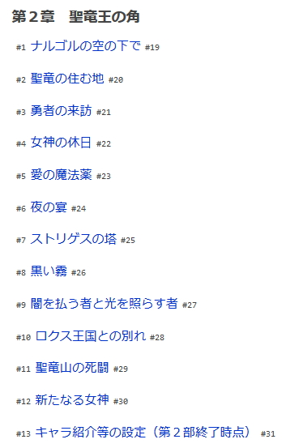

# syosetu-list-number

> syosetu-list-number 讓小說家的章節顯示序列

## install

1. 請參閱 [安裝需求](https://github.com/bluelovers/gm-user-scripts/blob/master/readme/userscript.md)

### 腳本

#### syosetu-list-number

然後點擊此處安裝腳本 [syosetu-list-number.user.js](https://github.com/bluelovers/gm-user-scripts/raw/master/dist/syosetu-list-number.user.js)

## test link

- https://ncode.syosetu.com/n8961ch/
- 
