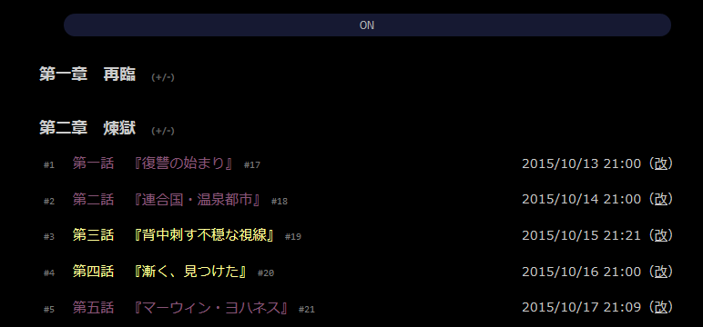
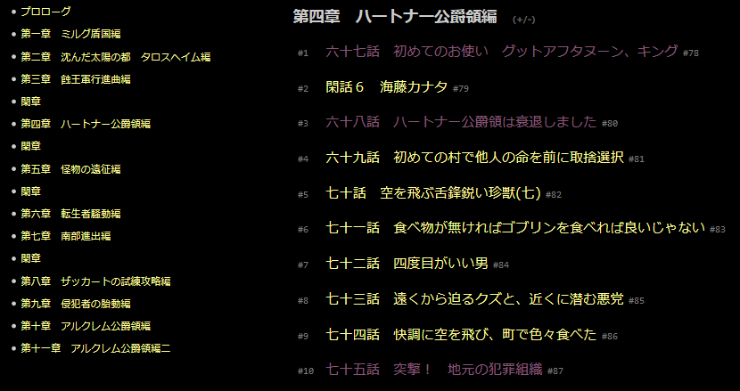

# syosetu-list-number

> syosetu-list-number 讓小說家的章節顯示序列 (支援手機版)

## install

1. 請參閱 [安裝需求](https://github.com/bluelovers/gm-user-scripts/blob/master/readme/userscript.md)

### 腳本

#### syosetu-list-number

然後點擊此處安裝腳本

* [syosetu-list-number.user.js](https://github.com/bluelovers/gm-user-scripts/raw/master/dist/syosetu-list-number.user.js)
* [greasyfork](https://greasyfork.org/zh-TW/scripts/39307-syosetu-list-number) - 備用安裝連結

## 功能

- 章節顯示序列
- 可折疊章節
- 複製章節內容時不會產生額外的多餘空白行
- 自動登入 r18 (因為有些人被長城牆了某些腳本 導致無法點擊按鈕)
- 其他介面微調
- 浮動索引 TOC
- 

### 預覽圖

#### PC

> 序列

> 章節折疊

> 浮動章節導覽

> 複製文章

#### Mobile

## test link

- https://ncode.syosetu.com/n8961ch/
- 
