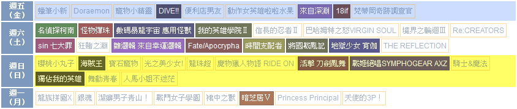
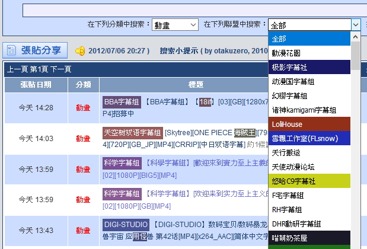

# ux-tweak-sc

> 各種網站 UX 優化 與 搭配某些插件/行為時的簡化動作

## install

1. 請參閱 [安裝需求](userscript.md)

### 腳本

#### ux-tweak-sc

安裝連結 [ux-tweak-sc.user.js](https://github.com/bluelovers/gm-user-scripts/raw/master/dist/ux-tweak-sc.user.js)

old version: https://gist.github.com/bluelovers/5186199
